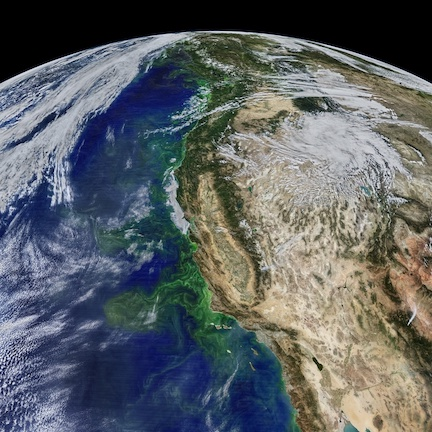

## Thomas Kilpatrick, Ph.D. 



Research scientist in atmoshere-ocean interactions and climate variability.

Scripps Institution of Oceanography, UC San Diego.


## About

My research aims to better understand regional-scale interactions between components of the earth system, which strongly influence the climate variability that is "felt" by communities and nations, including the response to climate change.

Specific problems I have worked on recently:
- orographic wind forcing of coastal ocean circulation
- coupling between the surface wind field and rainfall
- SST - wind coupling in western boundary current regions

The approach I have developed is to combine observational (satellite and in situ) data analyses with computer simulations. This is a powerful method for developing robust explanations of earth system processes. I have also utilized modern data science methods (deep learning) for atmosphere–ocean interaction problems and satellite data algorithm development.

In addition to my appointment at Scripps, I am an affiliate scientist at NASA Jet Propulsion Laboratory (JPL), where I work with the radar science group.


```markdown
Syntax highlighted code block

# Header 1
## Header 2
### Header 3

- Bulleted
- List

1. Numbered
2. List

**Bold** and _Italic_ and `Code` text

[Link](url) and 
```

For more details see [GitHub Flavored Markdown](https://guides.github.com/features/mastering-markdown/).

### Jekyll Themes

Your Pages site will use the layout and styles from the Jekyll theme you have selected in your [repository settings](https://github.com/tomkilpatrick/tomkilpatrick.github.io/settings). The name of this theme is saved in the Jekyll `_config.yml` configuration file.

### Support or Contact

Having trouble with Pages? Check out our [documentation](https://help.github.com/categories/github-pages-basics/) or [contact support](https://github.com/contact) and we’ll help you sort it out.
